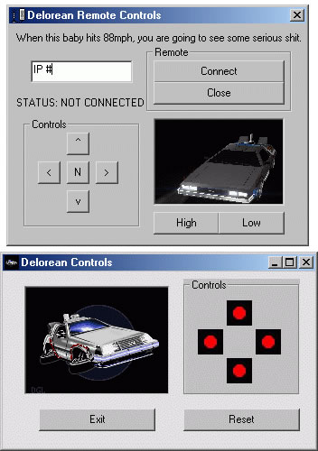



## RC to control over the internet

### Description

This code is to control your Remote control car over the internet through the parallel port

more pictures you can find here

http://basicrobotics.net/carcontrol.html
 
### More Info
 

             |
---                |---
**Submitted On**   |2007-12-03 20:49:52
**By**             |[Andres Bella](https://github.com/Planet-Source-Code/PSCIndex/blob/master/ByAuthor/andres-bella.md)
**Level**          |Intermediate
**User Rating**    |5.0 (10 globes from 2 users)
**Compatibility**  |VB 6\.0
**Category**       |[Miscellaneous](https://github.com/Planet-Source-Code/PSCIndex/blob/master/ByCategory/miscellaneous__1-1.md)
**World**          |[Visual Basic](https://github.com/Planet-Source-Code/PSCIndex/blob/master/ByWorld/visual-basic.md)
**Archive File**   |[RC\_to\_cont2092711232007\.zip](https://github.com/Planet-Source-Code/andres-bella-rc-to-control-over-the-internet__1-69714/archive/master.zip)

